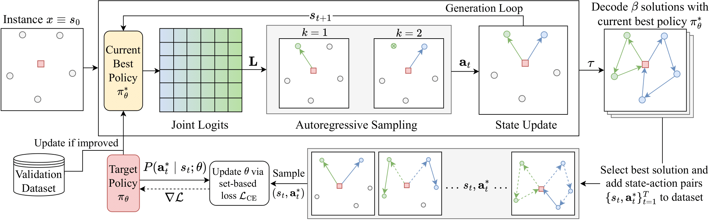
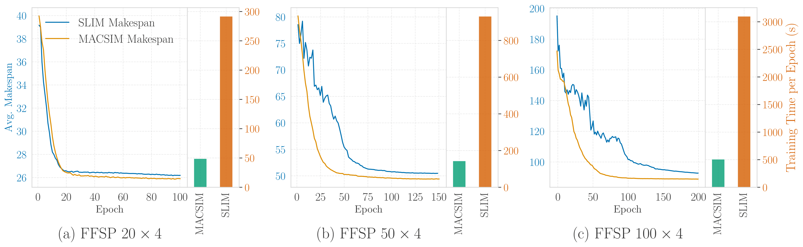

# MACSIM

MACSIM: Multi-action Self-Improvement Method for Neural Combinatorial Optimization



## Overview

**MACSIM** is a learning algorithm + neural policy that utilizes self-improvement to learn to solve multi-agent CO problems like min-max VRPs or scheduling problems. 
It targets these cooperative multi-agent combinatorial optimization problems by predicting **joint agent–task assignments** at each decision step and training with a **permutation-invariant set-based loss**. This enables coordinated multi-agent behavior, improved sample efficiency, and faster solution generation during self-improvement.

Below figure shows the training curves of MACSIM and standard self-improvement method (SLIM) on different FFSP instances:



---

## Key ideas & contributions

- **Multi-agent policy**: a decoder-only model predicting joint agent–task logits in one forward pass, amortizing computation across agents.  
- **Autoregressive joint-action sampling**: samples valid, conflict-free matchings from joint logits without replacement while retaining coordination.  
- **Set-based (permutation-invariant) surrogate loss**: supervises on the set of expert assignments rather than a single ordered sequence, stabilizing gradients and exploiting agent-permutation symmetries.  
- **Skip token**: allows agents to defer actions (with an annealed penalty) to improve solution quality in problems with strong inter-agent dependencies.  
- **Empirical validation**: experiments on Flexible Job Shop Scheduling (FJSP), Flexible Flow Shop Scheduling (FFSP), and Heterogeneous Capacitated VRP (HCVRP) show MACSIM outperforms prior neural baselines and reduces inference latency vs. standard self-improvement methods.

See the paper for definitions, proofs, and full experimental details.

---

## Project structure

```
macsim/
    train.py            # Training entrypoint
    test.py             # Evaluation / inference entrypoint
    algorithms/         # Implementations of learning algorithms (SLIM/MACSIM, PPO, REINFORCE)
    decoding/           # greedy / sampling decoding strategies
    envs/               # Problem environments: FJSP, FFSP, HCVRP
    models/             # Model components (encoders, decoders)
    utils/              # Utilities (datasets, schedulers, metrics, helper functions)
configs/                # Hydra/YAML experiment configs
```

---

## Installation

It is recommended to install this repository in a freshly created Python environment with Python version 3.10, e.g. via conda:

```bash
conda create -n macsim Python=3.10
```

Then, clone and install the library and required dependencies as follows:

```bash
git clone <REPO-URL>
cd macsim
pip install .
```

> Recommended: CUDA-enabled PyTorch for GPU training/inference.

---


## Training Quick start
Hydra is used to compose and override configuration files which can be found in ```configs/```.   

Below CLI command starts a training run for MACSIM on the Flexible Job Shop Scheduling Problem (FJSP):
```bash
python macsim/train.py env=fjsp/10j-5m model=macsim policy=macsim
```

Hydra lets you override config values from the CLI, for example:
```bash
python macsim/train.py env=fjsp/10j-5m model=macsim policy=macsim ++model.num_starts=100
```

> Important: This lets you control ```model.rollout_batch_size``` which is the batch size in the data generation loop of the self improvement method (this can be very memory consuming due to model.num_starts rollouts per batch instance):

```bash
# set model.rollout_batch_size depending on available memory
python macsim/train.py env=fjsp/10j-5m model=macsim policy=macsim model.rollout_batch_size=50
```

## Test & reproducibility

Go to [this link](https://osf.io/5z2aj/?view_only=783b0bb138e64431a681fd36452ea710) and download the trained_models.zip from the OSF server. Unpack the zip file at root level of this repository. The trained_models folder contains the pytorch lightning checkpoints for the models evaluated in the paper, e.g. MACSIM trained on FJSP $10 \times 5$ instances: 

>```trained_models/fjsp/10j-5m/macsim/checkpoints/last.ckpt```

As well as the hydra configuration file that was used for the respective training run:

>```trained_models/fjsp/10j-5m/macsim/.hydra/config.yaml```


Now we can evaluate a trained model (e.g. on FJSP 10j-5m) on a specified environment (e.g. FJSP 20j-10m). Note, a model trained on e.g. FJSP instances can only be evaluated on FJSP instances:
```bash
python macsim/test.py env=fjsp/20j-10m ++test.checkpoint=trained_models/fjsp/10j-5m/slim/checkpoints/last.ckpt ++test.num_decoding_samples=1280 ++test.decode_type=sampling
```


---

### Logging & monitoring

- Console logging enabled by default.  
- Optional integration with Weights & Biases (W&B) for experiment tracking. Configure W&B and enable logging by passing ```logger=wandb``` in the corresponding CLI command.  


---

### Experiments & Results (summary)

The paper evaluates MACSIM on three problem families:

- **Flexible Job Shop Scheduling (FJSP)** — minimize makespan.  
- **Flexible Flow Shop Scheduling (FFSP)** — minimize makespan across stages.  
- **Min-max Heterogeneous Capacitated Vehicle Routing (HCVRP)** — minimize maximum route length for workload balancing.

High-level outcomes reported in the paper:

- MACSIM achieves the best neural solver results on FFSP testbeds.  
- On FJSP, MACSIM narrows the gap to OR-Tools and outperforms it on some larger, out-of-distribution instances.  
- For HCVRP, MACSIM improves solution quality and reduces generation latency compared to standard self-improvement baselines.

**Detailed tables, ablations, and plots** are available in the paper.

---

### How the code corresponds to the paper

- `models/encoder` contains the encoder architectures used to compute agent and task embeddings.
- `models/decoder` contains the single-agent and multi-agent decoder architectures used to compute logits L given the embeddings.  
- `models/decoder/multi_agent.py` the multi-agent decoder implements the autoregressive sampling logic and the multi-action evaluation (via ```get_logp_of_action```) needed for imitation learning.
- `models/nn` contains mostly environment specific modules, like projection layers from feature to embedding space, skip-token implementation etc.
- `decoding/` simple module for greedy decoding and multi-start sampling.
- `algorithms/sl/` implements the self-improvement training loop (elite sampling, pseudo-expert dataset assembly, imitation learning). Implements both SLIM and MACSIM depending on policy (single-agent or multi-agent), and the chosen loss function.
- `env/` Multi-agent and single-agent environments for the FJSP, FFSP, and HCVRP.
---